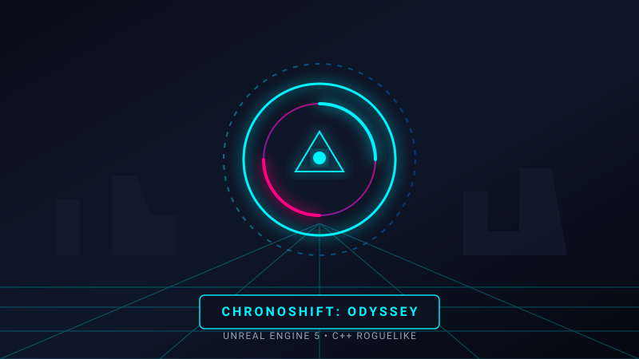

# Game Developer Portfolio Website

A sleek, responsive, cyberpunk-inspired game developer portfolio designed to showcase video games, technical breakdowns, gameplay trailers, playable WebGL/itch.io embeds, and game programming skills.



---

## 🚀 Quick Start (Local Preview)

### Method 1: One-Click Batch Script
Double-click `start_server.bat` in the root folder. It will start a local Python HTTP server and automatically launch your browser at `http://localhost:8000`.

### Method 2: Command Line (PowerShell / Terminal)
```powershell
py -m http.server 8000
```
Then navigate to [http://localhost:8000](http://localhost:8000) in your browser.

---

## 📁 Project Structure

```
Website/
├── index.html              # Main HTML markup and semantic layout
├── start_server.bat        # One-click Windows local server launcher
├── README.md               # Documentation & customization guide
│
├── css/
│   ├── style.css           # Core styling, responsive layouts, color themes
│   └── game-ui.css         # Game HUD styling, corner cuts, glows, badges
│
├── js/
│   ├── main.js             # Project renderer, modal popup, filter controller
│   ├── projects-data.js    # Data file: Add/edit your games and skills here!
│   ├── canvas-bg.js        # Interactive particle/starfield canvas background
│   └── audio-fx.js         # Procedural Web Audio API sound FX (pure synthesized)
│
└── assets/
    └── images/             # Game banners, artwork, and avatar
        ├── avatar.svg
        ├── project-chronoshift.svg
        ├── project-aetheria.svg
        ├── project-overdrive.svg
        ├── project-neonroots.svg
        └── project-novashader.svg
```

---

## 🎮 How to Customize

### 1. Adding or Editing Games
Open [`js/projects-data.js`](js/projects-data.js). You will find the `projects` array. Each game object looks like this:

```javascript
{
  id: "my-game-id",
  title: "My Awesome Game",
  tagline: "Short 1-sentence hook",
  category: "unreal", // options: "unreal", "unity", "godot", "jam", "tool"
  tags: ["Unreal Engine 5", "C++", "Action"],
  engine: "Unreal Engine 5.4",
  role: "Gameplay Programmer",
  year: "2024",
  status: "Released",
  thumbnail: "assets/images/my-game-thumb.png", // Or .jpg / .svg
  banner: "assets/images/my-game-banner.png",
  trailerUrl: "https://www.youtube-nocookie.com/embed/YOUR_VIDEO_ID",
  itchEmbedUrl: "", // Optional itch.io or WebGL iframe embed
  steamUrl: "https://store.steampowered.com/app/...",
  itchUrl: "https://yourname.itch.io/game",
  githubUrl: "https://github.com/...",
  quickStats: [
    { label: "Engine", value: "UE 5.4" },
    { label: "Role", value: "Lead Dev" }
  ],
  summary: "Brief synopsis of your game...",
  highlights: [
    "Implemented custom boss AI state machine.",
    "Built dynamic spatial audio system with FMOD."
  ],
  techBreakdown: {
    architecture: "Event-driven C++ subsystem...",
    optimization: "Reduced draw calls by 40% with HLOD..."
  }
}
```

### 2. Updating Your Bio & Social Links
In the same file ([`js/projects-data.js`](js/projects-data.js)), edit the `bioData` object:
- Change `name`, `title`, `tagline`, and `email`.
- Update your URLs for Steam, itch.io, GitHub, LinkedIn, ArtStation, YouTube, and Discord.

### 3. Updating Skills & Engines
Edit `skillsData` in [`js/projects-data.js`](js/projects-data.js) to adjust your engine proficiencies, programming languages, and specialized disciplines.

---

## 🌐 Free Deployment Options

Because this site has **zero external build dependencies**, deploying it takes less than 2 minutes:

### GitHub Pages (Recommended)
1. Initialize git and push to GitHub:
   ```bash
   git init
   git add .
   git commit -m "Initial game portfolio"
   git branch -M main
   git remote add origin https://github.com/your-username/your-repo.git
   git push -u origin main
   ```
2. In your GitHub repository, go to **Settings > Pages**.
3. Under **Branch**, select `main` and `/ (root)`, then click **Save**.
4. Your website will be live at `https://your-username.github.io/your-repo/`!

### Netlify / Vercel / Cloudflare Pages
- Simply drag and drop the `Website` folder directly into [Netlify Drop](https://app.netlify.com/drop) or link your repository. No build command needed!

---

## 🔊 Interactive Features Included
- **Zero-Dependency Procedural Audio**: Uses the Web Audio API to create authentic sci-fi/arcade clicks and feedback tones without loading external MP3 files. Muted by default with an easy toggle button in the header.
- **Dynamic Category Filtering**: Instant filtering across Unreal Engine, Unity, Godot, Game Jams, and Tools.
- **Deep-Dive Case Study Lightbox**: Full technical post-mortems with responsive 16:9 video embeds and metric breakdowns.
- **Interactive Particle Background**: 60 FPS GPU-friendly canvas network that responds smoothly to cursor proximity.
